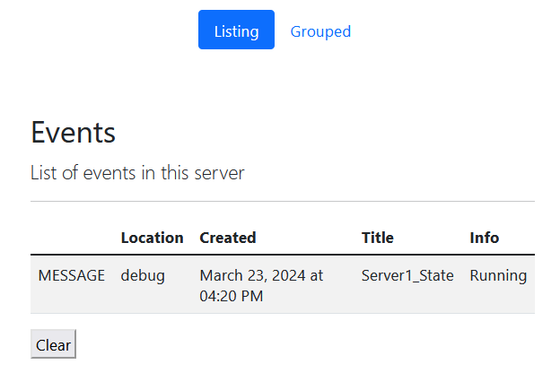

# Messages Server

A lightweight server to receive/show messages.

Use it to:
* **Inform yourself/your team** with **automated messages**
* **Keep track** of systems' states

Done by:
* **Receive messages** from your systems/code, **using HTTP requests**

## Configuration

Edit: **src/main/resources/application.properties**

Edit these values to match your **email server and server enviroment**:

```
server.port = 80
email.receiver=yourmail@domain.com

email.sender=sendermail@domain.com
email.host=EMAIL_HOSTNAME
email.username=EMAIL_USERNAME
email.password=EMAIL_PASSWORD

app.url=http://localhost
```

## Example

Post a message to the server:

```
curl -X POST "localhost/info?location=debug&title=Server1_State&text=Running"
```

This will add a message to the server (http://localhost/index.html):



### Add Messages: Python Examples

[docs/1_Python_Examples.md](docs/1_Python_Examples.md)

### Add Messages: Bash Examples

[docs/2_Bash_Examples.md](docs/2_Bash_Examples.md)

### Add Messages: Curl Examples

[docs/3_Curl_Examples.md](docs/3_Curl_Examples.md)
